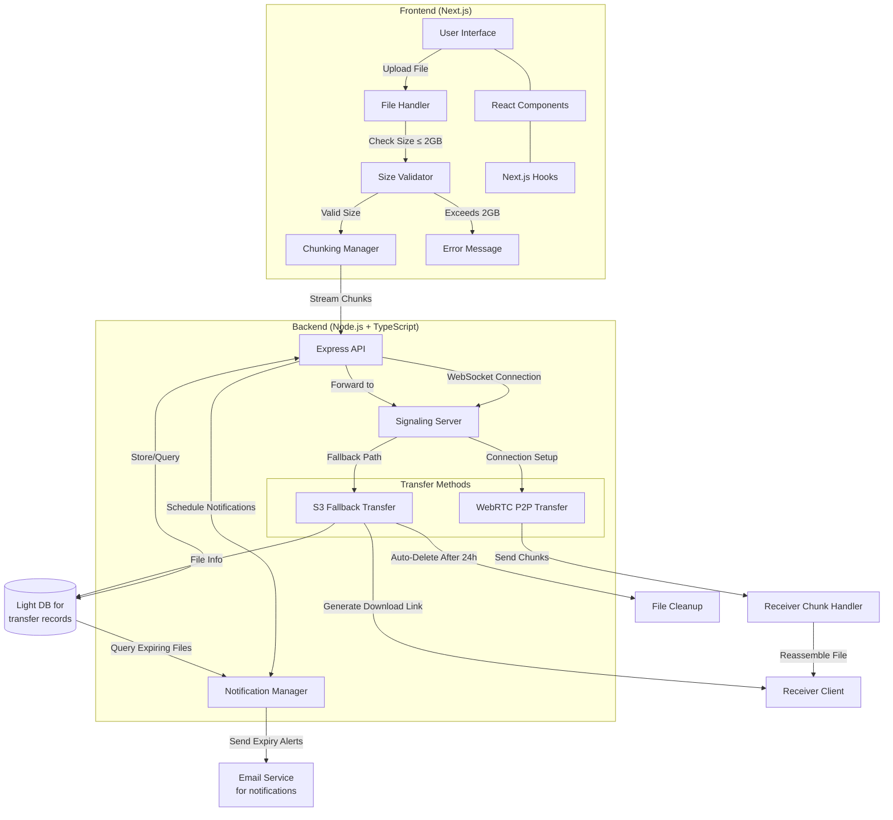

```mermaid
flowchart TD
    %% Frontend Tech Stack
    subgraph Frontend["Frontend (Next.js)"]
        UI[User Interface]
        UI -->|Upload File| FM[File Handler]
        FM -->|Check Size ≤ 2GB| VS[Size Validator]
        VS -->|Valid Size| CH[Chunking Manager]
        VS -->|Exceeds 2GB| ER[Error Message]
        RC[React Components]
        HK[Next.js Hooks]
        UI --- RC
        RC --- HK
    end

    %% Backend Tech Stack
    subgraph Backend["Backend (Node.js + TypeScript)"]
        API[Express API]
        SS[Signaling Server]
        NM[Notification Manager]
        
        subgraph Transfer["Transfer Methods"]
            WebRTC[WebRTC P2P Transfer]
            S3[S3 Fallback Transfer]
        end
        
        API -->|WebSocket Connection| SS
        SS -->|Connection Setup| WebRTC
        SS -->|Fallback Path| S3
        API -->|Schedule Notifications| NM
    end

    %% Database for minimal state
    DB[(Light DB for<br>transfer records)]
    API <-->|Store/Query| DB
    
    %% Notification System
    NS[Email Service<br>for notifications]
    NM -->|Send Expiry Alerts| NS

    %% Flow Control
    CH -->|Stream Chunks| API
    API -->|Forward to| SS
    WebRTC -->|Send Chunks| RCH[Receiver Chunk Handler]
    RCH -->|Reassemble File| ReceiverClient[Receiver Client]
    S3 -->|Generate Download Link| ReceiverClient
    
    %% File Management
    S3 -->|File Info| DB
    DB -->|Query Expiring Files| NM
    S3 -->|Auto-Delete After 24h| Cleanup[File Cleanup]
```